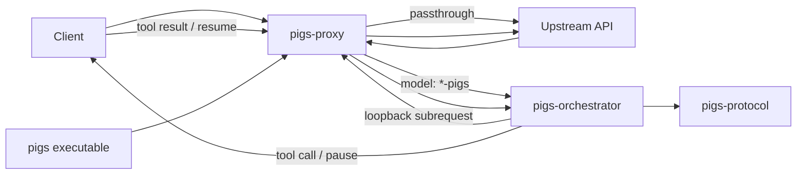

<div align="center">

# PIGS

**Adaptive LLM orchestration, delivered as a protocol-compatible Rust proxy.**

[简体中文](./README_CH.md) · [Architecture Docs](./index.html) · [Evaluation](./evaluation/README.md) · [MIT License](./LICENSE)


</div>

---

PIGS is a Rust front proxy for LLM APIs. Ordinary requests pass through normally; supported `POST` requests whose model name ends in `-pigs` or `-pig` enter an adaptive **Pre → Executor → Post** orchestration flow. The legacy `-pigsb` suffix remains supported.

The Pre prompt is chosen from the **real upstream model name** after removing the PIGS suffix: names containing `deepseek` use the frozen **DeepSeek v5** full prompt; names containing `muse` use the frozen **Muse v6** full prompt; all others use a concise generic prompt abstracted from their common task analysis, execution, and verification requirements. Matching is ASCII case-insensitive; the user's language selects the Chinese or English edition. There is no model-specific addendum and no change to Executor/Post.

The core idea is deliberately small:

```text
model-x       → normal passthrough
model-x-pigs  → PIGS orchestration (combined phase output) → upstream model-x
model-x-pig   → PIGS orchestration (one accepted business output) → upstream model-x
```

No custom client SDK is required. The client keeps speaking familiar OpenAI- or Anthropic-style APIs, while PIGS decides whether a request can finish on a simple path or should enter a fuller execution and verification path.

> [!NOTE]
> This README documents the Rust PIGS runtime itself: proxying, orchestration, protocols, tools, streaming, configuration, and diagnostics.

## ✨ Highlights

| Capability | What PIGS does |
|---|---|
| **Adaptive routing** | Pre decides whether a task is genuinely simple or should enter the full execution path. |
| **Three protocol surfaces** | OpenAI Chat Completions, OpenAI Responses, and Anthropic Messages. |
| **Suffix-based opt-in** | Add `-pigs` for combined phase output or `-pig` for one accepted business output (`-pigsb` is a legacy alias); no suffix means passthrough. |
| **Client-owned tools** | Tool calls are returned to the client; PIGS pauses and resumes the same phase after matching tool results arrive. |
| **Streaming support** | SSE text and reasoning can be forwarded incrementally while internal control markers stay hidden. |
| **Continuation state** | Multi-round tool interactions can resume without reinjecting the phase prompt. |
| **Deep diagnostics** | Optional HTTP capture records client, loopback, upstream, and orchestration decision/outcome exchanges. |
| **Rust workspace** | Protocol, orchestration, proxy transport, and executable responsibilities are separated into focused crates. |

## 🧠 How PIGS works

```text
                              model without -pigs / -pig / -pigsb
Client ───────► PIGS ─────────────────────────────────► Upstream
                  │
                  │ model ends in -pigs / -pig / -pigsb
                  ▼
                 Pre
          ┌───────┴────────┐
          │                │
     simple task       complex task
          │                │
          ▼                ▼
       complete         Executor
                           │
                    tool call? ─────► Client
                           ▲             │
                           └── result ───┘
                           │
                           ▼
                          Post
                 ┌──────┼──────┐
               PIGEND PIGNEXT PIGFAIL
                 │       │       │
              complete repair  re-plan
```

### 1. Pre — understand and route

Pre analyzes the task before the full execution path is entered. It considers:

- required project-internal and external information;
- the task goal and **conditions that can change the result**;
- ambiguity, multiple reasonable interpretations, and meaningful uncertainty;
- execution and verification strategy;
- whether the task is genuinely simple.

A simple task may be completed directly in Pre.

For safety, a Pre `PIGEND` is valid only when substantive user-facing text exists before the marker. A bare `PIGEND` cannot complete the simple path.

If the initial request exposes usable client tools and does not explicitly set `tool_choice = none`, PIGS preserves function-calling semantics instead of allowing a Pre text shortcut to consume the tool path.

### 2. Executor — do the work

Executor receives the Pre analysis and performs the task.

It can span multiple tool round-trips. PIGS itself does **not** execute client tools:

1. the model requests a tool;
2. PIGS pauses the current phase;
3. the native tool call is returned to the client;
4. the client executes it and sends the result back;
5. PIGS matches the pending tool-call IDs and resumes the same phase.

### 3. Post — verify and route

Post inherits the complete Executor protocol context and independently checks whether the task is complete.

- `PIGEND` → accept the current result, including a truthful terminal state that cannot be reliably improved further;
- `PIGNEXT` → the current path is repairable; return concise verifier feedback and run another Executor from the last Executor checkpoint;
- `PIGFAIL` → the current execution path is fundamentally wrong; return to Pre for replanning;
- no control marker → retry Post as verifier-protocol incompletion within the separate Post retry budget.

Post is verification/routing only. It may use tools to verify facts or state, but it does not continue execution, modify the result, or rewrite the answer itself.

### Token-limit truncation

If the upstream explicitly reports that generation stopped because of a token limit, PIGS treats that phase as **incomplete** rather than silently forwarding a partial phase result.

Currently recognized stop reasons:

| Protocol | Stop reason |
|---|---|
| OpenAI Chat | `length` |
| Anthropic Messages | `max_tokens` |
| OpenAI Responses | `max_output_tokens` |

PIGS currently surfaces this as an orchestration error; it does not automatically retry a truncated phase.

## 🔌 Supported API surfaces

| API surface | Typical path | Support |
|---|---|---:|
| OpenAI Chat Completions | `/chat/completions` or a path ending in it | ✅ |
| OpenAI Responses | `/responses` or a path ending in it | ✅ |
| Anthropic Messages | `/v1/messages` or a path ending in it | ✅ |

A request enters orchestration only when all three conditions are true:

1. HTTP method is `POST`;
2. the path matches one of the supported protocol surfaces;
3. JSON `model` ends in `-pigs`, `-pig`, or the legacy alias `-pigsb`.

Everything else uses the normal passthrough path.

> [!IMPORTANT]
> A `POST` to a recognized protocol path is parsed as JSON so PIGS can inspect `model`. Invalid JSON therefore returns `400` even when the request would not ultimately use a suffixed PIGS model.

## 🚀 Quick start

### Prerequisites

- Rust toolchain with Cargo
- an OpenAI-compatible and/or Anthropic-compatible upstream API

### Build

```bash
git clone https://github.com/HunLuanZhiZhu/pigs.git
cd pigs
cargo build --release
```

Binary:

```text
target/release/pigs
```

On Windows:

```text
target\release\pigs.exe
```

### Configure

PIGS loads configuration in this order:

```text
config.local.toml
        ↓
config.toml
        ↓
generate config.toml if neither exists
```

A convenient local setup is to copy `config.toml` to `config.local.toml` and edit the private copy.

```toml
listen = "127.0.0.1:3927"

# Empty: preserve client credentials.
# Non-empty: override client authorization / x-api-key.
key = ""

[logging]
detail = "basic"          # off | basic | max
directory = "logs/http"

[upstream]
openai    = "https://your-openai-compatible-upstream.example/v1"
responses = "https://your-openai-compatible-upstream.example/v1"
anthropic = "https://your-anthropic-upstream.example"
```

PIGS chooses the base URL by protocol, then appends the **client's original path and query string**.

For a one-off run, all three upstream bases can be overridden together:

```bash
./target/release/pigs --base-url http://127.0.0.1:8080
```

### Run

```bash
./target/release/pigs
```

Useful CLI options:

```text
--listen ADDRESS
--base-url URL
--log-detail off|basic|max
--log-dir PATH
--example
-h, --help
```

### Enable orchestration

Normal passthrough:

```json
{
  "model": "your-model"
}
```

PIGS orchestration:

```json
{
  "model": "your-model-pigs"
}
```

PIGS strips `-pigs` before contacting the upstream and restores the original client-visible model name when synthesizing the final orchestration response.

Example:

```bash
curl http://127.0.0.1:3927/chat/completions \
  -H "content-type: application/json" \
  -H "authorization: Bearer YOUR_KEY" \
  -d '{
    "model": "your-model-pigs",
    "messages": [
      {"role": "user", "content": "Solve this task and verify the result."}
    ]
  }'
```

## 🛠️ Tool calling & continuation

Tool definitions, `tool_choice`, tool results, historical tool calls, images, and other supported non-text content are preserved through the orchestration path as far as the protocol layer models them.

Current continuation behavior:

| Property | Current behavior |
|---|---|
| Store | in-memory |
| Capacity | 64 continuations |
| TTL | 30 minutes |
| Multi-round tools | supported inside the same phase |
| Matching | all pending tool-call IDs must be present in the new request |
| Unmatched tool result | HTTP `409` |
| Process restart | continuations are lost |
| Consumed calls | not replayed in the final completed response |

Phase prompts are injected when a phase starts, not on every tool resume.

## 🌊 Streaming

When the client sends `"stream": true`, PIGS uses the streaming orchestration path.

- upstream SSE is parsed incrementally;
- visible text passes through `MarkerFilter`, keeping `PIGEND` / `PIGFAIL` internal;
- reasoning/thinking events are forwarded when the source protocol exposes them;
- tool/native blocks that cannot be reconstructed incrementally may be emitted during finalization;
- finalization closes any still-open protocol block before emitting the terminal event; for Responses this guarantees `response.completed.response.output` contains the committed text even if the last phase did not emit a separate end event;
- after client SSE has started, later orchestration errors must be represented inside the stream because the HTTP status can no longer be changed.

For non-streaming requests, PIGS reads a complete upstream JSON/SSE phase response and synthesizes the final client response after orchestration.

## 🧩 Architecture



### Workspace layout

| Crate | Responsibility | Docs |
|---|---|---|
| `pigs` | CLI, configuration loading, logging, service startup | [HTML](./crates/pigs/index.html) |
| `pigs-proxy` | HTTP entrypoint, routing, passthrough, loopback, client response streaming | [HTML](./crates/pigs-proxy/index.html) |
| `pigs-orchestrator` | Pre / Executor / Post state machine, continuation, phase prompts | [HTML](./crates/pigs-orchestrator/index.html) |
| `pigs-protocol` | Protocol detection, JSON/SSE parsing, request surgery, response synthesis | [HTML](./crates/pigs-protocol/index.html) |

Dependency direction:

```text
pigs → pigs-proxy → pigs-orchestrator → pigs-protocol
```

For the implementation-oriented overview, see **[Architecture Docs](./index.html)**.

## ⚙️ Request and response behavior

### Passthrough requests

Requests outside PIGS orchestration preserve the method, path, and query string. The proxy removes hop-by-hop/content-length-related headers where required by transport, while normal end-to-end headers are generally retained.

Passthrough responses preserve upstream status and stream the body as bytes. Compression headers remain aligned with the forwarded body.

### Orchestrated requests

The parent JSON body is parsed into `serde_json::Value` and later reserialized for subrequests. Semantic fields are preserved, but **byte-for-byte JSON identity is not guaranteed**.

The main orchestration path keeps fields such as:

`tools`, `tool_choice`, `stream`, `temperature`, `max_tokens`, `thinking`, `reasoning`, `response_format`, `stream_options`, and `parallel_tool_calls`.

### Orchestrated responses

An orchestrated response is **synthesized**, not a raw copy of one upstream phase response.

PIGS reconstructs the client protocol response from accumulated text/parts, filtered control markers, reasoning/native blocks that were parsed, the final stop reason, and the selected usage object.

## 🔐 Authentication

When `key = ""`, client authorization headers are preserved.

When `key` is non-empty, PIGS replaces client `authorization` / `x-api-key` and sends:

```text
authorization: Bearer <key>
x-api-key: <key>
```

## 🔎 Diagnostics

PIGS has two logging layers:

- regular tracing output to console and daily files under `logs/`;
- optional HTTP exchange capture controlled by `[logging]`.

`logging.detail`:

| Value | Capture |
|---|---|
| `off` | disabled |
| `basic` | metadata, headers, sizes, exchange information |
| `max` | basic data plus complete request/response bodies |

HTTP capture can record:

- client request / response;
- internal loopback request / response;
- real upstream request / response;
- orchestration decision;
- orchestration outcome.

Streaming captures include `capture_complete` so interrupted body capture can be distinguished from a normally observed EOF.

> [!CAUTION]
> Authentication headers and common sensitive query parameters are redacted, but request/response **bodies are not semantically redacted**. `max` logging can therefore contain prompts, model outputs, and tool results in plaintext. Use it only in controlled environments.

## 📌 Current implementation notes

These are deliberate documentation of the current Rust implementation, not promises of features that do not exist yet.

- Continuations live only in process memory and do not survive restart.
- Orchestration usage reporting is configurable with `[orchestration].usage_mode`.
- `max` (default) returns the complete upstream usage object from the real call with the largest `total_tokens` value; if `total_tokens` is absent, PIGS falls back to the protocol's main input + output token fields. This mode is intended for coding agents that use the latest response usage as a context-window signal.
- `sum` recursively adds numeric fields from every real upstream call triggered by the current client API request, including nested cache/reasoning details. This mode is intended for evaluation and real-consumption accounting.
- Tool-call pause responses also report usage. When a continuation is resumed by a new client API request, usage aggregation starts from zero again so the same physical model calls are not counted twice.
- Transport/parser errors stop the current orchestration; there is no generic orchestrator-level automatic retry.
- The internal `x-pigs-loopback` header is currently not stripped before the real upstream forwarding step and may reach the upstream.
- `legacy/` is historical reference code; the Rust workspace and current docs define the active behavior.

For exact implementation contracts, see **[AGENTS.md](./AGENTS.md)**.

## 🧪 Development

Format:

```bash
cargo fmt --all
```

Check:

```bash
cargo check --workspace
```

Test:

```bash
cargo test --workspace
```

Run from source:

```bash
cargo run -p pigs -- --listen 127.0.0.1:3927
```

## 📄 License

PIGS is licensed under the [MIT License](./LICENSE).

---

<div align="center">

**PIGS · opt in with a suffix, keep the API surface familiar.**

[中文文档](./README_CH.md) · [Architecture](./index.html)

</div>
