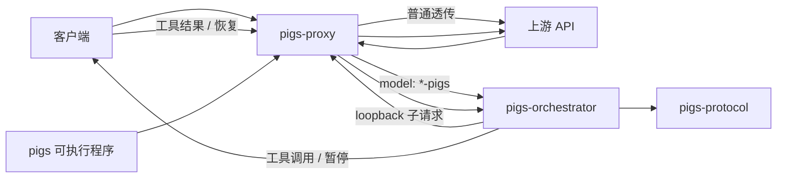

<div align="center">

# PIGS

**以协议兼容的 Rust 前置代理，实现自适应 LLM 编排。**

[English](./README.md) · [架构说明](./index.html) · [正式评测](./evaluation/README_CH.md) · [MIT License](./LICENSE)


</div>

---

PIGS 是一个用 Rust 编写的 LLM 前置代理。普通请求正常透传；当受支持的 `POST` 请求中，模型名以 `-pigs` 或 `-pig` 结尾时，请求会进入自适应的 **Pre → Executor → Post** 编排流程。旧后缀 `-pigsb` 暂时兼容。

进入编排后，Pre 会根据**剥除 PIGS 后缀的真实模型名**选择完整提示词：名称包含 `deepseek` 使用历史 **DeepSeek v5** 原版，包含 `muse` 使用历史 **Muse v6** 原版，其他模型使用从二者共同原则抽象的精简通用 Pre。名称匹配不区分 ASCII 大小写；中文或英文模板根据用户问题自动选择。不拼接额外的模型专属段落，Executor/Post 保持不变。

核心使用方式非常简单：

```text
model-x       → 普通透传
model-x-pigs  → PIGS 编排（拼接阶段输出）→ 上游 model-x
model-x-pig   → PIGS 编排（仅提交一个有效业务结果）→ 上游 model-x
```

客户端不需要引入专用 SDK，仍然使用熟悉的 OpenAI / Anthropic 风格 API。PIGS 在代理层判断任务应直接走简单路径，还是进入完整的执行与核验路径。

> [!NOTE]
> 本 README 只介绍 Rust 版 PIGS 本体：代理、编排、协议、工具调用、流式、配置与诊断。

## ✨ 主要能力

| 能力 | PIGS 当前实现 |
|---|---|
| **自适应路径** | Pre 判断任务是真正简单，还是需要进入完整执行路径。 |
| **三种 API 协议面** | 支持 OpenAI Chat Completions、OpenAI Responses、Anthropic Messages。 |
| **模型后缀开关** | `-pigs` 拼接阶段输出；`-pig` 只提交一个有效业务结果（旧 `-pigsb` 兼容）；不带后缀正常透传。 |
| **工具调用友好** | 工具由客户端实际执行；PIGS 暂停当前 phase，并在工具结果返回后恢复。 |
| **流式优先** | 支持增量 SSE 文本与 reasoning/thinking，同时隐藏内部控制标记。 |
| **Continuation** | 同一 phase 可经历多轮工具往返，恢复时不会重复注入 phase 提示词。 |
| **完整诊断链路** | 可记录客户端、内部 loopback、真实上游，以及编排 decision/outcome。 |
| **清晰 Rust workspace** | 协议、编排、代理传输与可执行入口职责分离。 |

## 🧠 PIGS 如何工作

```text
                              model 不带 -pigs / -pig / -pigsb
客户端 ──────► PIGS ───────────────────────────────► 上游
                 │
                 │ model 以 -pigs / -pig / -pigsb 结尾
                 ▼
                Pre
         ┌───────┴────────┐
         │                │
       简单任务          复杂任务
         │                │
         ▼                ▼
       完成            Executor
                          │
                   工具调用? ─────► 客户端
                          ▲            │
                          └── 结果 ────┘
                          │
                          ▼
                         Post
                ┌──────┼──────┐
              PIGEND PIGNEXT PIGFAIL
                │       │       │
              完成     修补     重规划
```

### 1. Pre —— 理解任务并选择路径

Pre 在进入完整执行路径之前先分析任务，包括：

- 需要哪些项目内部信息和外部信息；
- 任务目标以及**会影响结果的关键条件**；
- 是否存在题意不清、多种合理解释或关键条件不确定；
- 应如何执行和核验；
- 任务是否真的足够简单。

简单任务可以直接在 Pre 完成。

为了避免简单路径只有控制词却没有真正答案，Pre 中只有在 `PIGEND` 前已经存在实质性用户可见文本时，`PIGEND` 才有效。单独输出一个 `PIGEND` 不能完成 Pre 简单路径。

如果初始请求提供了可用客户端工具，并且没有显式设置 `tool_choice = none`，PIGS 会保留 function-calling 语义，不允许 Pre 的文本捷径吞掉工具路径。

### 2. Executor —— 真正执行任务

Executor 接收 Pre 的分析并完成任务本身。

一个 Executor phase 可以经历多轮工具调用。PIGS **不会代替客户端执行工具**：

1. 模型请求工具；
2. PIGS 暂停当前 phase；
3. 按原生协议形状把工具调用返回客户端；
4. 客户端执行工具并回填结果；
5. PIGS 根据 pending tool-call ID 恢复同一个 phase。

### 3. Post —— 独立核验并决定下一步

Post 直接继承 Executor 已形成的完整协议上下文，对执行结果进行独立核验。

- `PIGEND` → 接受当前结果；也包括任务已经无法可靠继续改进、且当前结果如实反映这一终止状态的情况；
- `PIGNEXT` → 当前执行路径仍可修补；Post 给出简短核验反馈，系统砍回最近一次 Executor checkpoint 再运行下一次 Executor；
- `PIGFAIL` → 当前执行路径存在根本性错误，回到 Pre 重新规划；
- 没有控制标记 → 视为核验器协议未完成，在独立的 Post 协议重试预算内重试。

Post 只负责核验和路由。它可以使用工具验证事实或实际状态，但不会自行继续执行、修改结果或重写答案。

### Token 上限截断

如果上游明确表示这一轮是因为生成 token 上限而结束，PIGS 会把它视为**未完成的 phase**，不会把半截 Pre / Executor / Post 当成正常产物继续向后传。

当前识别：

| 协议 | 停止原因 |
|---|---|
| OpenAI Chat | `length` |
| Anthropic Messages | `max_tokens` |
| OpenAI Responses | `max_output_tokens` |

当前行为是返回独立的编排截断错误；PIGS 暂时不会自动重试被截断的 phase。

## 🔌 支持的 API

| API | 常见路径 | 支持 |
|---|---|---:|
| OpenAI Chat Completions | `/chat/completions` 或以其结尾的路径 | ✅ |
| OpenAI Responses | `/responses` 或以其结尾的路径 | ✅ |
| Anthropic Messages | `/v1/messages` 或以其结尾的路径 | ✅ |

只有同时满足以下三个条件，才进入 PIGS 编排：

1. HTTP 方法为 `POST`；
2. 路径能识别为支持的协议；
3. JSON 中的 `model` 以 `-pigs`、`-pig` 或兼容别名 `-pigsb` 结尾。

其它请求走普通透传。

> [!IMPORTANT]
> 对已识别协议路径的 `POST`，PIGS 需要先解析 JSON 才能读取 `model`。因此即使最终模型不带 PIGS 后缀，非法 JSON 也会直接返回 `400`。

## 🚀 快速开始

### 环境

- Rust 工具链与 Cargo
- 一个兼容 OpenAI 和/或 Anthropic 协议的上游 API

### 编译

```bash
git clone https://github.com/HunLuanZhiZhu/pigs.git
cd pigs
cargo build --release
```

生成：

```text
target/release/pigs
```

Windows：

```text
target\release\pigs.exe
```

### 配置

PIGS 按以下优先级加载配置：

```text
config.local.toml
        ↓
config.toml
        ↓
两者都不存在时生成 config.toml
```

推荐把仓库中的 `config.toml` 复制成 `config.local.toml`，然后只修改本地私有配置。

```toml
listen = "127.0.0.1:3927"

# 留空：保留客户端鉴权。
# 非空：覆盖客户端 authorization / x-api-key。
key = ""

[logging]
detail = "basic"          # off | basic | max
directory = "logs/http"

[upstream]
openai    = "https://your-openai-compatible-upstream.example/v1"
responses = "https://your-openai-compatible-upstream.example/v1"
anthropic = "https://your-anthropic-upstream.example"
```

PIGS 会根据协议选择对应 base URL，然后拼接**客户端原始 path 和 query string**。

也可以在单次运行中把三个协议的上游统一覆盖：

```bash
./target/release/pigs --base-url http://127.0.0.1:8080
```

### 启动

```bash
./target/release/pigs
```

常用 CLI：

```text
--listen ADDRESS
--base-url URL
--log-detail off|basic|max
--log-dir PATH
--example
-h, --help
```

### 开启 PIGS

普通透传：

```json
{
  "model": "your-model"
}
```

开启 PIGS：

```json
{
  "model": "your-model-pigs"
}
```

PIGS 发往真实上游前会去掉 `-pigs`，最终合成客户端响应时仍恢复客户端原本看到的 `-pigs` 模型名。

示例：

```bash
curl http://127.0.0.1:3927/chat/completions \
  -H "content-type: application/json" \
  -H "authorization: Bearer YOUR_KEY" \
  -d '{
    "model": "your-model-pigs",
    "messages": [
      {"role": "user", "content": "完成这个任务，并自行核验最终结果。"}
    ]
  }'
```

## 🛠️ 工具调用与 Continuation

工具定义、`tool_choice`、工具结果、历史工具调用、图片以及协议层已支持的其它非文本内容，会尽量在编排过程中保留。

当前 continuation 行为：

| 属性 | 当前实现 |
|---|---|
| 存储 | 进程内存 |
| 容量 | 64 条 |
| TTL | 30 分钟 |
| 同 phase 多轮工具调用 | 支持 |
| 匹配规则 | 新请求中必须出现该 continuation 的全部 pending tool-call ID |
| 工具结果无法匹配 | HTTP `409` |
| PIGS 重启 | continuation 丢失 |
| 已消费工具调用 | 最终 Completed 响应不会重复返回 |

Phase 提示只在进入该 phase 时注入一次，工具暂停/恢复不会再次注入。

## 🌊 流式

客户端发送 `"stream": true` 时，PIGS 使用流式编排路径。

- 增量解析上游 SSE；
- 用户可见文本经过 `MarkerFilter`，不会泄露内部 `PIGEND` / `PIGFAIL`；
- 协议提供 reasoning/thinking 时，可以增量转发；
- 无法实时完整还原的工具/native 块可能在收尾阶段补发；
- 收尾时会先关闭任何仍打开的协议块再发送终止事件；对 Responses，这保证即使最后一个 phase 没有额外发送独立 End，`response.completed.response.output` 仍包含已经提交的正文；
- 一旦客户端 SSE 已开始，后续编排错误只能写入流内，因为 HTTP 状态码已经无法改写。

非流式请求则会读取完整 phase 响应，完成编排后再合成客户端 JSON 响应。

## 🧩 架构



### Workspace 结构

| Crate | 职责 | 详细说明 |
|---|---|---|
| `pigs` | CLI、配置加载、日志、启动服务 | [HTML](./crates/pigs/index.html) |
| `pigs-proxy` | HTTP 入口、分流、透传、loopback、客户端响应流 | [HTML](./crates/pigs-proxy/index.html) |
| `pigs-orchestrator` | Pre / Executor / Post 状态机、continuation、phase 提示 | [HTML](./crates/pigs-orchestrator/index.html) |
| `pigs-protocol` | 协议判定、JSON/SSE 解析、请求体手术、响应合成 | [HTML](./crates/pigs-protocol/index.html) |

依赖方向：

```text
pigs → pigs-proxy → pigs-orchestrator → pigs-protocol
```

更细的实现说明见 **[架构说明页](./index.html)**。

## ⚙️ 请求与响应语义

### 普通透传

不进入 PIGS 编排的请求会保留客户端 method、path 与 query string。代理层会按 HTTP 传输需要过滤 hop-by-hop / content-length 等相关 header，其它普通端到端 header 默认保留。

透传响应保留上游状态码，并以字节流回传 body。压缩 body 与 `content-encoding` 保持对应。

### 编排请求

父请求 body 会先解析成 `serde_json::Value`，子请求再重新序列化，因此保留的是 JSON **语义字段**，不保证字节级完全一致。

当前主链路会保留例如：

`tools`、`tool_choice`、`stream`、`temperature`、`max_tokens`、`thinking`、`reasoning`、`response_format`、`stream_options`、`parallel_tool_calls`。

### 编排响应

PIGS 的编排响应是**重新合成**的，不是某一轮上游响应的原样转发。

PIGS 会根据整轮编排得到的文本/parts、过滤后的控制标记、已解析 reasoning/native block、最后一轮 stop reason，以及当前选中的 usage 对象，重新生成客户端协议响应。

## 🔐 鉴权

当 `key = ""` 时，保留客户端鉴权头。

当 `key` 非空时，PIGS 会移除客户端原有 `authorization` / `x-api-key`，然后发送：

```text
authorization: Bearer <key>
x-api-key: <key>
```

## 🔎 诊断与抓包

PIGS 有两层日志：

- 普通 tracing：控制台 + `logs/` 下按日文件；
- 由 `[logging]` 控制的 HTTP 交换抓包。

`logging.detail`：

| 值 | 内容 |
|---|---|
| `off` | 关闭 HTTP 抓包 |
| `basic` | 元数据、header、body 大小、交换信息 |
| `max` | basic + 完整请求/响应 body |

HTTP 抓包可以记录：

- 客户端 request / response；
- 内部 loopback request / response；
- 真实 upstream request / response；
- orchestration decision；
- orchestration outcome。

流式抓包还会记录 `capture_complete`，用于区分“完整观察到 EOF”和“响应 body 中途被丢弃”。

> [!CAUTION]
> 鉴权 header 和常见敏感 query 参数会自动打码，但请求/响应 **body 不做语义脱敏**。`max` 模式可能以明文保存用户 prompt、模型输出和工具结果，只适合受控环境。

## 📌 当前实现边界

以下内容是对当前 Rust 实现的如实说明，不代表已经实现尚不存在的能力。

- continuation 只存在进程内存中，服务重启后不会恢复。
- 编排响应的 usage 由 `[orchestration].usage_mode` 控制。
- `max`（默认）返回 `total_tokens` 最大的一次真实上游调用的完整 usage；若上游没有 `total_tokens`，则用协议主输入字段 + 主输出字段回退计算。该模式用于普通 coding agent 判断上下文占用。
- `sum` 将本次客户端 API 请求触发的所有真实上游调用 usage 按 JSON 路径递归聚合，数值字段逐项相加，包括嵌套的缓存和 reasoning 明细。该模式用于模型评测和真实消耗统计。
- 工具暂停响应也会返回 usage；客户端回填工具结果并恢复 continuation 时，从零重新统计新一发客户端请求的 usage，避免重复计费。
- transport / parser 错误会终止当前编排，目前没有通用的 orchestrator 自动重试。
- 内部 `x-pigs-loopback` header 当前没有在真实上游转发前被过滤，因此可能到达上游。
- `legacy/` 仅作为历史参考；当前 Rust workspace 与当前文档描述的是实际实现。

需要精确实现契约时，请看 **[AGENTS.md](./AGENTS.md)**。

## 🧪 开发

格式化：

```bash
cargo fmt --all
```

检查：

```bash
cargo check --workspace
```

测试：

```bash
cargo test --workspace
```

直接从源码运行：

```bash
cargo run -p pigs -- --listen 127.0.0.1:3927
```

## 📄 License

PIGS 使用 [MIT License](./LICENSE)。

---

<div align="center">

**PIGS · 用一个模型后缀开启编排，同时保持熟悉的 API。**

[English](./README.md) · [架构说明](./index.html)

</div>
